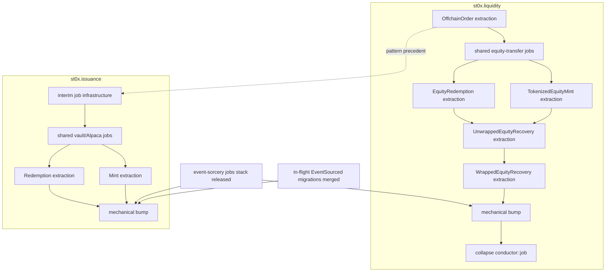

# ADR-0002: Gradual consumer migration from `Services` to `Jobs`

## Status

Proposed.

## Context

[ADR-0001](0001-jobs-replace-services.md) replaces `EventSourced::Services` with
`EventSourced::Jobs`: handlers become sync and pure, side effects move into
durable apalis jobs, and job enqueue commits in the same SQLite transaction as
the events that trigger it. The library change is a **hard break** -- the
reshaped event-sorcery has no `Services` hook left at all.

Two consumers sit on the old API:

| Repo             | `EventSourced` impls | Handlers doing real I/O |
| ---------------- | -------------------- | ----------------------- |
| `st0x.liquidity` | 10                   | 5                       |
| `st0x.issuance`  | 5                    | 2                       |

**`st0x.liquidity`** -- semantic surface:

| Aggregate                 | Services                          | Inline side effects                                                                 |
| ------------------------- | --------------------------------- | ----------------------------------------------------------------------------------- |
| `OffchainOrder`           | `Arc<dyn OrderPlacer>`            | `place_market_order` against the broker                                             |
| `TokenizedEquityMint`     | `EquityTransferServices`          | Alpaca tokenizer issuance request + completion confirm                              |
| `EquityRedemption`        | `EquityTransferServices`          | vault lookup, `redemption_wallet`, `send_for_redemption`                            |
| `UnwrappedEquityRecovery` | `UnwrappedEquityRecoveryServices` | wrapper wrap submit/confirm, Raindex deposit submit/confirm, mint/redemption resume |
| `WrappedEquityRecovery`   | `WrappedEquityRecoveryServices`   | Raindex deposit submit/confirm, mint/redemption resume                              |

`VaultRegistry`, `Position`, `OnChainTrade`, `UsdcRebalance`, and
`InventorySnapshot` have `type Services = ()` -- their handlers do no I/O and
only need the signature change.

**`st0x.issuance`** -- semantic surface:

| Aggregate    | Services                | Inline side effects                                                                                          |
| ------------ | ----------------------- | ------------------------------------------------------------------------------------------------------------ |
| `Mint`       | `MintServices`          | Fireblocks `confirm_mint`, Alpaca calls, receipt registration, direct DB reads via a smuggled `Pool<Sqlite>` |
| `Redemption` | `Arc<dyn VaultService>` | Fireblocks `submit_burn` + burn confirmation                                                                 |

`Account`, `TokenizedAsset`, and `ReceiptInventory` are service-free.

### Why "bump first, migrate after" cannot work

A crate pins exactly one event-sorcery revision. The jobs-only API cannot
compile next to an inline `services.call().await`, so the dependency bump is
**atomic per repo**: every `impl EventSourced` must convert in the same PR that
bumps. If the semantic aggregates still run side effects in handlers at that
point, the bump PR has to rewrite five aggregates' business logic at once -- the
unreviewable big-bang this ADR exists to prevent.

### Constraints

- **In-flight work is untouchable.** Issuance's EventSourced migration
  (RAI-554..557, RAI-785) continues on the pull-out project against the current
  API. The issuance bump additionally cannot land until those merge, because it
  touches every impl.
- **Liquidity owns the reference machinery.** `src/conductor/job.rs` is the
  battle-tested module ADR-0001 lifted into the library (`Job` trait,
  `JobQueue`, `build_supervised_worker!`, `FailureInjector`, tuned poll config).
  Issuance has no job runner at all.

## Decision

Invert the order: make every handler pure **first**, on the **current**
event-sorcery pin, using consumer-side job machinery. Bump **last**, as one
mechanical PR per repo. Liquidity leads; issuance follows once the pattern is
proven.

### Phase 1 -- extraction (one aggregate per PR, old API)

For each aggregate whose handlers perform I/O:

1. Split conflated commands into request/outcome pairs where needed: the handler
   records intent as an event, a durable job performs the external call, the job
   sends the outcome back as a command. Aggregates that already model
   Submit/Confirm pairs (both recovery aggregates) map 1:1.
2. Event vocabulary may **gain** events; existing event payloads are never
   mutated.
3. Reads smuggled through services (`MintServices.pool`, the bot address) move
   to command construction at the call site.
4. Failure-as-event semantics are preserved: where service failures are recorded
   as events today (`RecoveryFailed`), the job reports failure through an
   outcome command and the aggregate still decides the event.
5. Jobs are at-least-once from day one: outcome commands must be idempotent
   against aggregate state, covered by re-run/duplicate-outcome tests.
6. `type Services` shrinks toward `()` per aggregate; the associated type itself
   survives until the bump.

Liquidity extractions run on the existing `conductor::job` machinery. Issuance
first brings up an equivalent interim runner (same shape -- it is what the
library lifted) wired into the Rocket app, deleted again at the bump.

Crash-safety during phase 1 matches today's reactor-job pattern: enqueue is not
yet atomic with the event commit. That is no worse than the status quo, and
strictly better than inline effects -- the bump closes the remaining window.

Extraction PRs have **no dependency on the library jobs stack**. They can start
immediately against the current pin. Only the bumps gate on the `event-sorcery`
reshape landing.

### Phase 2 -- mechanical bump (one PR per repo)

Preconditions: all of that repo's extractions merged; the library jobs stack
released; for issuance, the in-flight EventSourced migrations merged.

The bump PR is signature-only per aggregate: drop `type Services`, add
`type Jobs`, handlers go sync, consumer `Job` impls re-point at the library
trait, pushes route through the library's buffered `JobQueue` so enqueue commits
inside the event transaction. No business-logic changes -- the extractions
already did those -- which is what makes a whole-repo diff reviewable.

A follow-up cleanup PR excises the duplicated machinery (`conductor::job`, the
issuance interim runner) and re-wires test failure-injection onto the library's
hooks. Parts may fold into the bump PR where the compiler forces it.

### Ordering

`OffchainOrder` goes first: one service, one call site, smallest PR to prove the
request -> job -> outcome shape. The shared equity-transfer module precedes the
four aggregates that consume `EquityTransferServices`, so they don't grow four
divergent copies of the same SDK wrappers. The recoveries go last among
extractions because they resume mints/redemptions and reuse both prior shapes.

### PR acceptance criteria

- One aggregate (or one shared module) per extraction PR.
- After an extraction PR, the aggregate's handlers contain no `.await` on
  services.
- Events added, never mutated; serialization tests assert literals.
- Idempotent outcome commands covered by job re-run tests.
- Bump PRs: signature-only per aggregate; atomic-enqueue path covered by an
  integration test.

## Consequences

**Positive**

- Reviewable, independently shippable steps; no long-lived branch.
- Extraction work is unblocked today -- no waiting on the library release.
- Each repo crosses the bump with zero inline I/O left, so the breaking change
  is mechanical where it is widest.
- Liquidity validates every shape (extraction, shared jobs, recovery semantics)
  before issuance's financial flows move.

**Negative**

- A transition period where job enqueue is not atomic with event commit (status
  quo today; closed at the bump).
- Request/outcome event splits ripple into projections and tests for aggregates
  whose events currently conflate decide and effect.
- Issuance temporarily vendors job machinery destined for deletion.

## Alternatives considered

- **Big-bang bump per repo.** Rejected: a single PR rewriting five semantic
  aggregates plus mechanical churn across the rest is unreviewable.
- **Keep `Services` alongside `Jobs` in the library.** Rejected in ADR-0001; a
  dual API leaves I/O reachable from handlers and defeats the invariant.
- **Stacked PR train on the new API (bump at the base).** Every stack entry must
  compile, so the base PR already has to convert all aggregates -- the big-bang
  in disguise.
- **Issuance first.** Rejected: liquidity owns the reference machinery, has more
  aggregates to validate the pattern cheaply, and issuance carries the in-flight
  EventSourced migration this work must not disturb.
